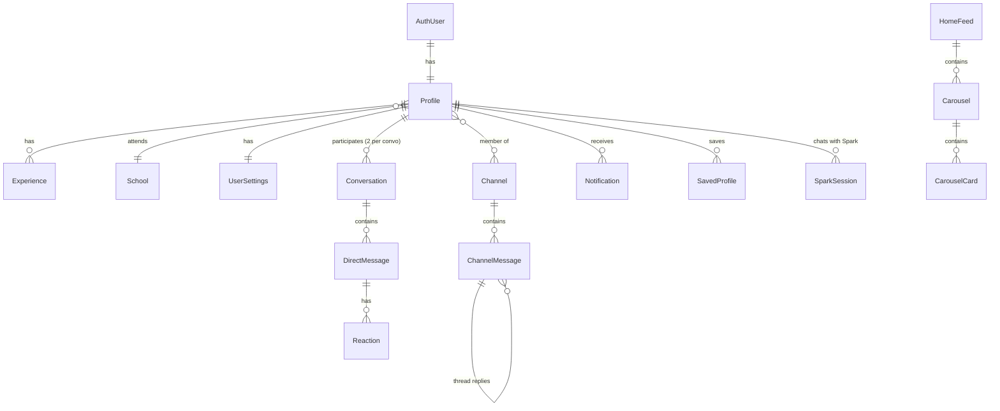

# Data Model

Entities observed in Icebreaker API responses. Types are TypeScript-style; `?` = may be null/absent. Examples are fictional. Source of truth in code: `src/types/api.ts`.

## AuthUser
| Field | Type | Req | Notes |
|---|---|---|---|
| id | uuid | ✓ | same as Profile.id |
| email | string | ✓ | |
| full_name | string? | | |
| is_email_verified | boolean | ✓ | |
| created_at | ISO date | ✓ | |

## Profile (self: `GET /profile`; others: `GET /discovery/profiles/{id}`)
| Field | Type | Req | Example |
|---|---|---|---|
| id | uuid | ✓ | |
| first_name / last_name | string | ✓ | "Sam" / "Lee" |
| photo_url | url? | | Cloudinary |
| my_icebreaker | string? | | "I once hiked Kilimanjaro." |
| city, city_display_name | string? | | "New Delhi, DL" (+ key/lat/lng/country fields) |
| hometown_display_name | string? | | |
| mba_school_id | int? | | 487 → School |
| mba_school_name / alias | string? | | "Example School (EXS)" / "EXS" |
| mba_grad_year | int? | | 2027 |
| mba_focus_primary/secondary | string? | | |
| undergrad_school | string? | | |
| current_company / current_title / current_industry | string? | | "Acme" / "Consultant" / "Technology & Software" |
| experiences | Experience[] | ✓ | |
| what_brings_you | string[] | | option values e.g. `finding_a_new_role` |
| passionate_about | string[] | | `product_management` |
| excited_cities | string[] | | `singapore` |
| help_others | string[] | | `resume_feedback` |
| affinity_tags | string[] | | `career_changer` |
| hobbies | string[]? | | |
| my_projects / project_brief / project_category | string? | | |
| linkedin_url | url? | | |
| is_verified, is_profile_complete | boolean | | |
| is_new, is_active | boolean? | | "NEW" pill / green dot |
| is_connected, has_messaged, can_message | boolean | | relationship to viewer |
| agent_beta_enabled, channels_enabled | boolean | | feature flags (self only) |

Option values map to labels via `GET /profile/options`.

## Experience
`id: uuid, is_current: boolean, company: string, title: string, start_year: int?, end_year: string? ("2026" | "Present"), display_order: int`

## School
`id: int, name: string, alias: string?, city?, state?, country?, domain?, is_active: boolean`

## Commonalities (derived, per viewed profile)
`commonalities: {category, label, items: string[]}[]`, `reasons_to_connect: {type, text}[]`

## HomeFeed / Carousel / CarouselCard
- HomeFeed: `featured_profile (Match of the Day)?, carousels: Carousel[], generated_at`
- Carousel: `id, carousel_type, primary_card_type ('profile'|'project'|'notable_icebreaker'), title, subtitle?, cards[], has_more`
- CarouselCard: `id, card_type, position, data` where `data` = `profile_id, first_name, last_name, photo_url, school_alias, mba_grad_year, current_title, current_company` + type-specific `project_brief/project_category` or `icebreaker_brief` or `shared_context[], is_saved, match_id, is_new, is_active`.

## Conversation
`id, created_at, updated_at, participant1_id, participant2_id, last_message?, last_message_at?, last_message_sender_id?, other_participant: ProfileSummary, unread_count: int, marked_unread: boolean`

## DirectMessage
`id, conversation_id, sender_id, content, created_at, is_read, read_at?, message_type ('text'), edited_at?, edit_count, deleted_at?, sender_profile, reactions?: Reaction[]`

## Reaction
`emoji: string, count: int, reacted_by_me: boolean`

## Channel
`id, slug, name, emoji, description, category ('interest'…), audience, member_count, is_member` + joined-only `unread_count, last_message_at, last_message_preview, last_message_sender, notification_level ('all'…)`

## ChannelMessage
`id, channel_id, content, created_at, edited_at?, deleted_at?, is_pinned, sender {user_id, first_name, last_name, photo_url}, reactions[], link_preview? {url,title,description,image_url,site_name}, media_type?, media_url?, media_width?, media_height?, mentioned_user_ids[], parent_message_id?, thread? {reply_count, last_reply_at, participants[], participant_count, has_unread_replies}, deleted_by_admin, edited_by_admin`

## Notification
`id, notification_type ('reminder'…), metadata {title?, body?, deep_link?, sender_id?, sender_name?, sender_photo_url?, conversation_id?, subject_topic?}, sent_at, read_at?, opened_at?, is_read, is_opened`

## UserSettings
`push_notifications, email_notifications, discovery_enabled, show_graduation_year: boolean; privacy_level: 'public'|…; theme_preference: 'system'|'light'|'dark'; blocked_users: uuid[]; has_shown_onboarding_tour, has_seen_welcome, match_eligible: boolean; terms_accepted_at, terms_version`

## SparkSession
`session_id: uuid; interactions: {id, type: 'message', details: {role: 'user'|'assistant', content}, created_at}[]`

## SavedProfile
`GET /home/saved-profiles → {profiles: [], total_count}` (item shape not observed — the test account had none).
